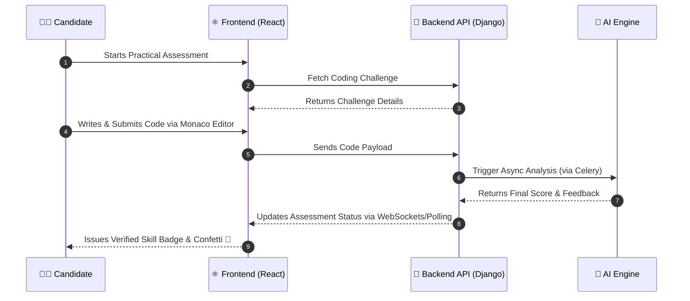
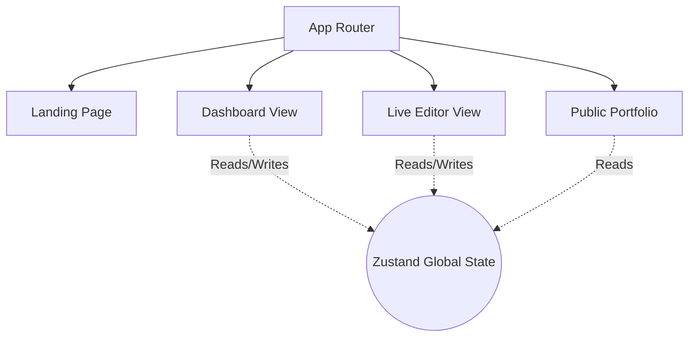

<div align="center">
  
# 🚀 SkillProof (Frontend)

**An AI-Verified Practical Skill Portfolio Platform**

[](https://opensource.org/licenses/MIT)
[](https://reactjs.org/)
[](https://vitejs.dev/)
[](https://tailwindcss.com/)
[](https://github.com/pmndrs/zustand)

*Prove what you can do. Get verified credentials through AI-monitored practical tests.*

[🌐 Live Frontend (Vercel)](https://skillproof-eight.vercel.app) · [⚙️ Backend API (Render)](https://skillproof-backend-3857.onrender.com)

</div>

---

## 📖 Table of Contents
- [About the Project](#-about-the-project)
- [Key Features](#-key-features)
- [System Architecture](#-system-architecture)
- [Frontend Deep Dive](#-frontend-deep-dive)
- [Tech Stack](#-tech-stack)
- [Project Structure](#-project-structure)
- [License](#-license)

---

## 🌟 About the Project

SkillProof bridges the gap between claims on a resume and actual capabilities. By utilizing advanced AI monitoring and real-time code evaluation, SkillProof provides an undeniable, cryptographically verified portfolio of a candidate's practical skills.

### 🎯 Why SkillProof?
- **For Candidates:** Stop relying on static resumes. Show actual proof of your coding abilities with verified skill badges.
- **For Recruiters:** Hire with confidence knowing the candidate's skills are verified in a proctored, AI-evaluated environment.

---

## ✨ Key Features

- 🤖 **AI-Observed Assessments:** Real-time monitoring and scoring of practical tests.
- 📜 **Verified Portfolios:** Shareable, tamper-proof credentials for recruiters.
- 💻 **Live Code Evaluation:** Secure execution and semantic analysis of submitted code.
- 🎨 **Premium UI/UX:** Built with Framer Motion and Tailwind for a rich, dynamic, and responsive experience.
- 📊 **Real-Time Dashboards:** Interactive charts and skill portfolio visualizations using Recharts.

---

## 🏗 System Architecture

The application follows a decoupled microservices-inspired architecture:

### 🔄 User Assessment Workflow

This sequence diagram illustrates how a candidate is evaluated in real-time across our Frontend and Backend systems:



---

## 🎨 Frontend Deep Dive

The SkillProof frontend is a modern SPA (Single Page Application) built for performance and aesthetics.

### 🧩 Component & State Flow



### ✨ Technical Highlights
- **Live Code Editor:** Integrated `@monaco-editor/react` for a VSCode-like real-time coding experience in the browser.
- **Micro-Animations:** Strategic use of `framer-motion` for fluid page transitions, hover effects, and engaging UI elements.
- **Strict Linting:** Configured with `oxlint` for blazingly fast and strict code quality checks.
- **Type Safety:** 100% written in TypeScript, ensuring robust data handling across the app.

---

## 💻 Tech Stack

<details open>
<summary><b>Frontend Details (This Repository)</b></summary>

- **Core:** React 19, TypeScript, Vite
- **Styling:** Tailwind CSS 4, Framer Motion
- **State Management:** Zustand
- **Editor:** Monaco Editor (`@monaco-editor/react`)
- **Routing:** React Router v7
- **Deployment:** Vercel
</details>

<details>
<summary><b>Backend Details (Separate Repository)</b></summary>

- **Core:** Python 3.11+, Django, Django REST Framework
- **Database:** PostgreSQL (Production: Supabase) / SQLite (Local)
- **Background Tasks:** Celery, Redis (Production: Upstash)
- **Deployment:** Render
</details>

---

## 📂 Project Structure Snapshot

```text
src/
├── assets/         # Static images and icons
├── components/     # Reusable UI elements (Buttons, Cards, Modals, Editor)
├── pages/          # Main route views (Dashboard, Editor, Landing, Portfolio)
├── services/       # Axios API clients for backend communication
├── store/          # Zustand state slices (Auth, Assessments, UI)
├── types/          # Global TypeScript interfaces
└── utils/          # Helper functions (Formatting, Validation)
```

---

## 📄 License

This project is licensed under the [MIT License](LICENSE).

<p align="center">
  Built with ❤️ by Ajay Vishwakarma
</p>
